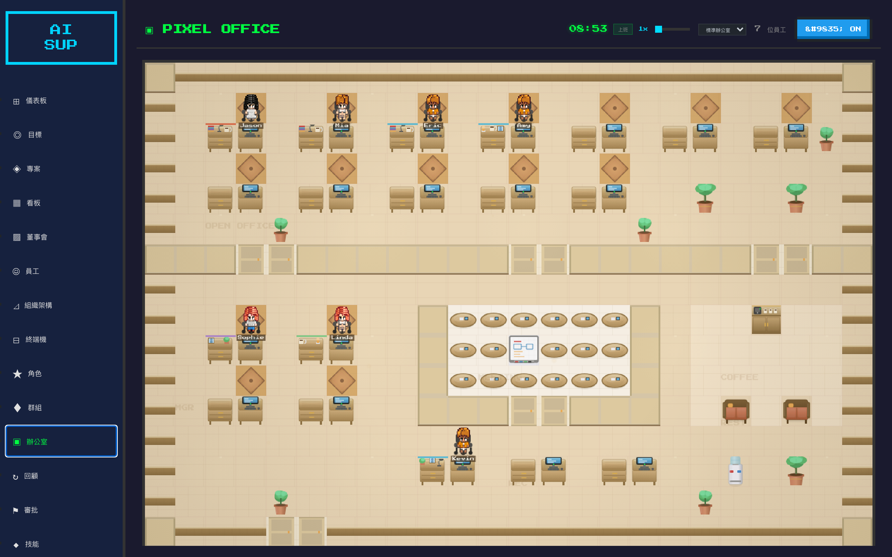
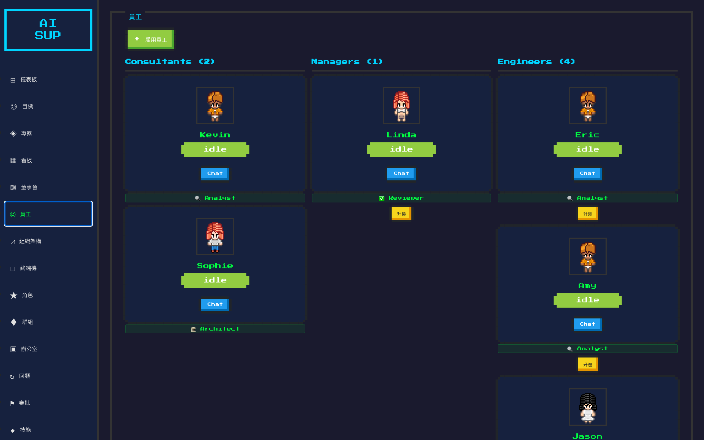
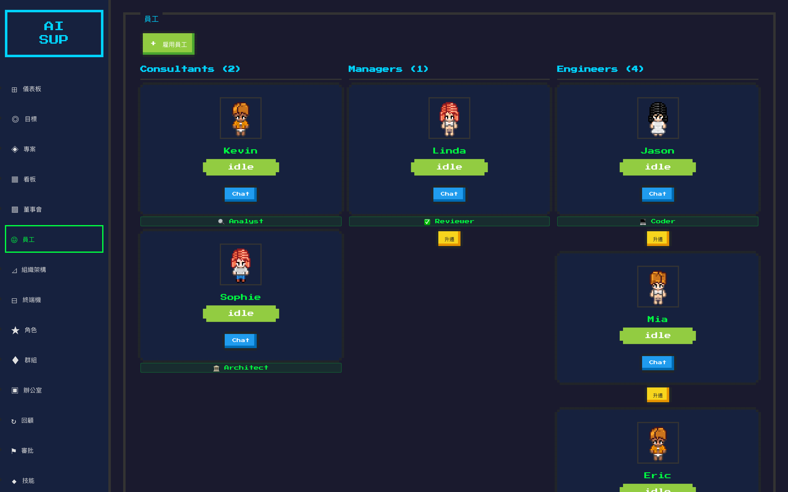
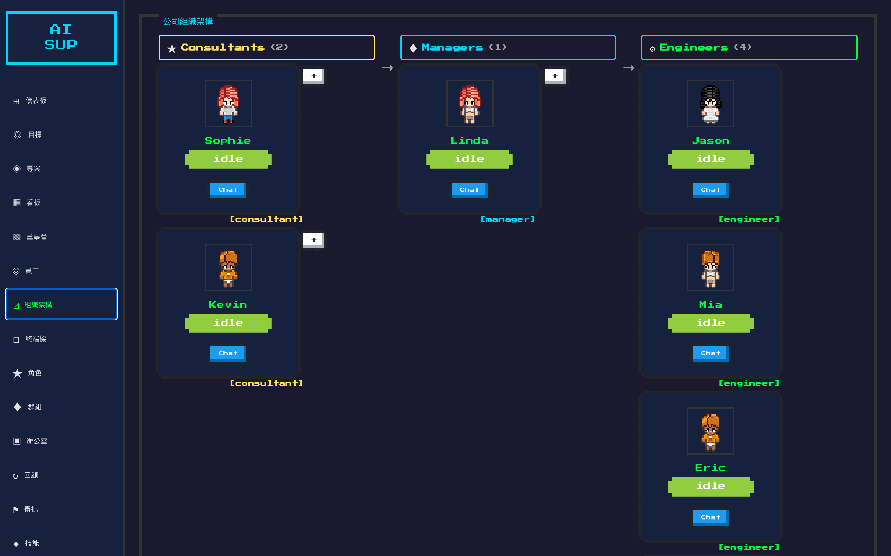
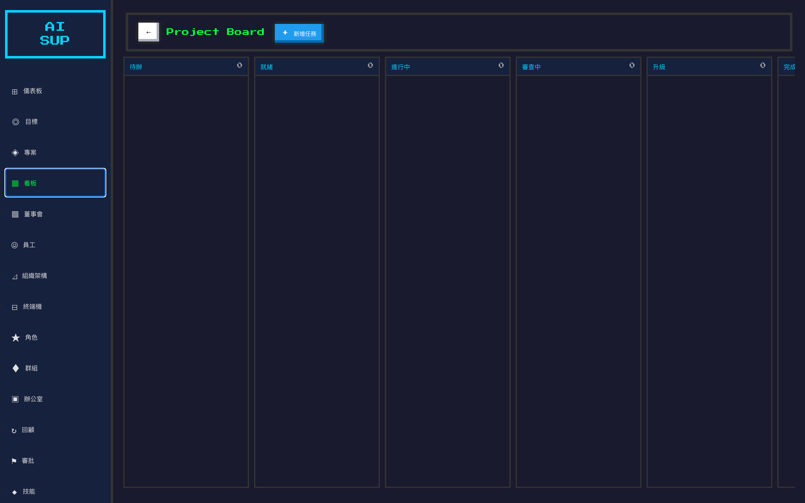
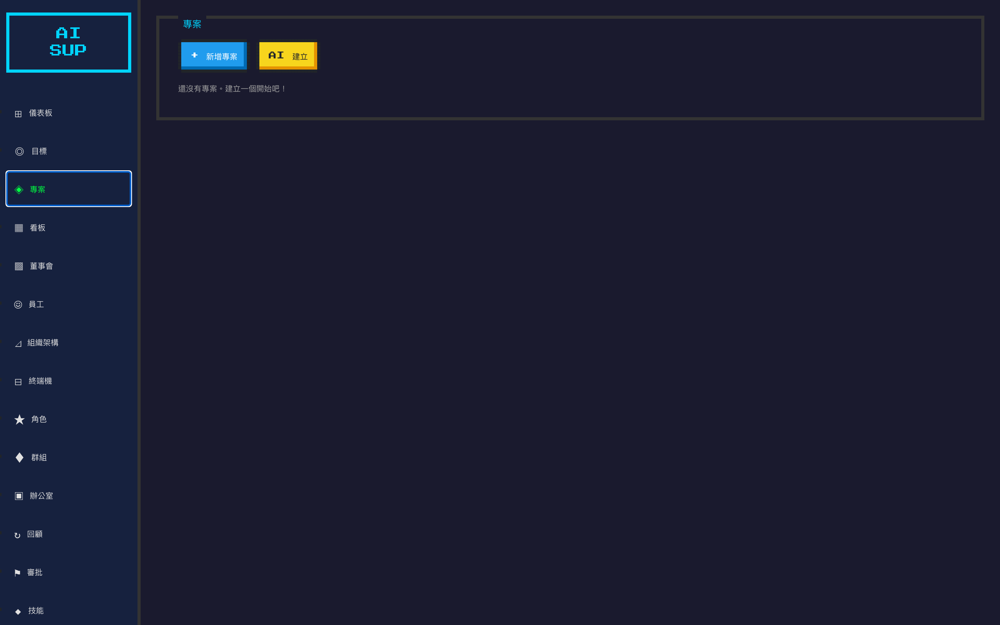
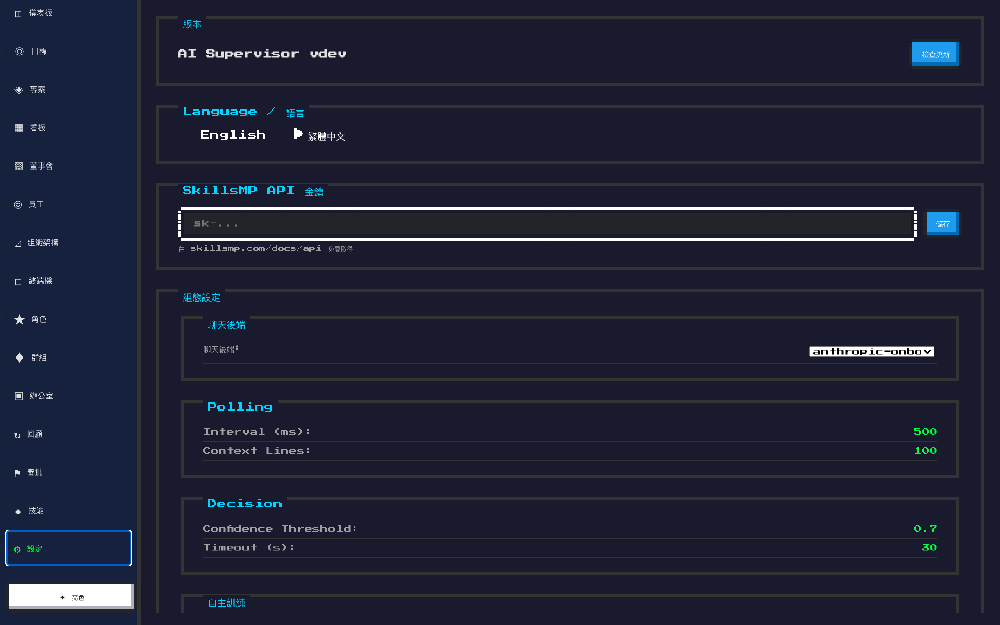

# AI Supervisor

[English](#english) | [繁體中文](#繁體中文)



---

## English

> A virtual office desktop app that manages AI workers — hire, assign tasks, review code, and watch your AI team collaborate in real time.

### What is AI Supervisor?

AI Supervisor is a **Wails v2 desktop application** (Go + Svelte) that turns AI coding assistants into a managed team of virtual employees. Think of it as a pixel-art office simulator where each "worker" is a real AI agent (Claude Code CLI) running in its own tmux session, writing actual code on your projects.

You are the boss. You hire workers, assign tasks, and they autonomously write code, create branches, submit for review, and iterate based on feedback — all while you watch from a retro-styled dashboard.

### Key Features

- **Guided Onboarding** — A conversational setup wizard helps you build your first AI team, complete with an HR specialist who recommends the right roles
- **Worker Management** — Hire AI workers with different skill profiles (coder, architect, QA, security, devops, designer, analyst, reviewer) and tiers (engineer, manager, consultant)
- **Task Pipeline** — Assign coding/research tasks to workers; each task gets its own git branch for isolation
- **Automated Code Review** — Completed tasks are automatically routed to a reviewer worker; approved code gets merged
- **Company Hierarchy** — Organize workers into teams with managers and consultants overseeing engineers
- **Personality System** — Each worker has unique personality traits, skill scores, moods, and relationships that evolve over time
- **AI-Generated Narratives** — Generate backstories and personality descriptions for your workers using AI
- **Training Loop** — Agentic training pipeline for autonomous code iteration and model fine-tuning
- **Multi-Backend Support** — Works with Claude Code CLI, Anthropic API, OpenAI, Ollama, and Google Gemini
- **Pixel Office** — A virtual office view where you can see your workers at their desks
- **Bilingual UI** — Full support for English and 繁體中文 (Traditional Chinese)

### Screenshots

| Pixel Office | Dashboard |
|:------------:|:---------:|
|  |  |

| Workers | Worker Detail |
|:-------:|:-------------:|
|  |  |

| Hierarchy | Kanban Board |
|:---------:|:------------:|
|  |  |

| Projects | Settings |
|:--------:|:--------:|
|  |  |

### How It Works

```
You (the Boss)
  │
  ├── Create a Project (linked to a git repo)
  ├── Break it into Tasks (code, research, review)
  └── AI Workers pick up tasks autonomously
        │
        ├── Each worker runs Claude Code CLI in a tmux pane
        ├── Creates a git branch per task
        ├── Writes code, runs tests
        ├── Submits for code review (another AI worker reviews)
        └── Approved → merged; Rejected → iterate
```

### Tech Stack

| Layer | Technology |
|-------|-----------|
| Backend | Go 1.23+, Wails v2 |
| Frontend | Svelte + Vite, NES.css (retro pixel theme) |
| AI Workers | Claude Code CLI in tmux sessions |
| Data Storage | YAML files (`~/.local/share/aisupervisor/company/`) |
| Configuration | `~/.config/aisupervisor/config.yaml` |

### Getting Started

#### Prerequisites

- **Go 1.23+**
- **Node.js 18+**
- **[Wails v2](https://wails.io/)** — `go install github.com/wailsapp/wails/v2/cmd/wails@latest`
- **tmux** — `brew install tmux` (macOS)
- **Claude Code CLI** — or another supported AI backend

#### Build & Run

```bash
# Development (hot-reload for frontend)
cd cmd/aisupervisor-gui && wails dev

# Production build
wails build

# Build + install on macOS
make install-mac
```

#### Configuration

On first launch, the onboarding wizard will guide you through setup. You can also manually configure:

```yaml
# ~/.config/aisupervisor/config.yaml
backends:
  - name: anthropic
    provider: anthropic
    apiKey: sk-ant-...
    model: claude-sonnet-4-20250514

polling:
  intervalMs: 500
  contextLines: 100
```

### Architecture

```
cmd/
  aisupervisor-gui/   # Wails v2 GUI entry point
  aisupervisor/       # TUI entry point (terminal mode)
internal/
  ai/                 # AI backend abstraction (anthropic, openai, ollama, gemini)
  company/            # Core business logic — task management, review pipeline
  config/             # App config + skill profiles
  gui/                # Wails bindings (Go ↔ Svelte bridge)
  personality/        # Worker personality traits, skill scores, narratives
  project/            # Project & Task data models
  worker/             # Worker spawner, monitor, session management
  tmux/               # tmux client for managing AI sessions
frontend/
  src/lib/
    components/       # Svelte UI components
    office/           # Pixel office simulation
    pages/            # Route pages
    stores/           # Svelte stores + i18n
```

### Documentation

- [Installation Guide](INSTALL.md) — User installation & developer build guide
- [GUI Manual](docs/GUI-MANUAL.md) — Complete UI operation manual
- [Docker Guide](docker/README.md) — Docker development environment

---

## 繁體中文

> 一款管理 AI 員工的虛擬辦公室桌面應用程式 — 招募、分配任務、審查程式碼，即時觀看你的 AI 團隊協作。

### 什麼是 AI Supervisor？

AI Supervisor 是一個 **Wails v2 桌面應用程式**（Go + Svelte），將 AI 程式助手轉化為一支受管理的虛擬員工團隊。可以把它想像成一個像素風格的辦公室模擬器，每位「員工」都是運行在獨立 tmux session 中的真實 AI 代理（Claude Code CLI），在你的專案中撰寫實際的程式碼。

你就是老闆。你招募員工、分配任務，他們會自主地撰寫程式碼、建立分支、提交審查、根據回饋迭代 — 而你在復古風格的儀表板上觀看一切。

### 主要功能

- **引導式入職** — 對話式設定精靈幫你建立第一支 AI 團隊，配備 HR 專員推薦適合的角色
- **員工管理** — 招募不同技能配置的 AI 員工（工程師、架構師、QA、安全、DevOps、設計師、分析師、審查員）和層級（工程師、管理者、顧問）
- **任務流水線** — 為員工分配程式/研究任務；每個任務都有獨立的 git 分支
- **自動程式碼審查** — 完成的任務自動轉給審查員；通過的程式碼自動合併
- **公司層級** — 將員工組織成團隊，管理者和顧問監督工程師
- **性格系統** — 每位員工都有獨特的性格特質、技能分數、心情和人際關係，會隨時間演變
- **AI 生成敘事** — 使用 AI 為員工生成背景故事和性格描述
- **訓練迴圈** — 自主訓練管線，用於程式碼迭代和模型微調
- **多後端支援** — 支援 Claude Code CLI、Anthropic API、OpenAI、Ollama 和 Google Gemini
- **像素辦公室** — 虛擬辦公室視圖，看到你的員工在桌前工作
- **雙語介面** — 完整支援 English 和繁體中文

### 運作方式

```
你（老闆）
  │
  ├── 建立專案（連結 git 倉庫）
  ├── 拆分為任務（程式、研究、審查）
  └── AI 員工自主領取任務
        │
        ├── 每位員工在 tmux pane 中運行 Claude Code CLI
        ├── 為每個任務建立 git 分支
        ├── 撰寫程式碼、執行測試
        ├── 提交給另一位 AI 員工進行程式碼審查
        └── 通過 → 合併；退回 → 迭代修正
```

### 技術架構

| 層級 | 技術 |
|------|------|
| 後端 | Go 1.23+, Wails v2 |
| 前端 | Svelte + Vite, NES.css（復古像素主題）|
| AI 員工 | Claude Code CLI（tmux sessions）|
| 資料儲存 | YAML 檔案（`~/.local/share/aisupervisor/company/`）|
| 設定檔 | `~/.config/aisupervisor/config.yaml` |

### 快速開始

#### 前置需求

- **Go 1.23+**
- **Node.js 18+**
- **[Wails v2](https://wails.io/)** — `go install github.com/wailsapp/wails/v2/cmd/wails@latest`
- **tmux** — `brew install tmux`（macOS）
- **Claude Code CLI** — 或其他支援的 AI 後端

#### 建置與執行

```bash
# 開發模式（前端熱更新）
cd cmd/aisupervisor-gui && wails dev

# 正式建置
wails build

# macOS 建置 + 安裝
make install-mac
```

#### 設定

首次啟動時，入職精靈會引導你完成設定。也可以手動設定：

```yaml
# ~/.config/aisupervisor/config.yaml
backends:
  - name: anthropic
    provider: anthropic
    apiKey: sk-ant-...
    model: claude-sonnet-4-20250514

polling:
  intervalMs: 500
  contextLines: 100
```

### 相關文件

- [安裝手冊](INSTALL.md) — 使用者安裝與開發者建置指南
- [GUI 操作手冊](docs/GUI-MANUAL.md) — 完整 UI 操作手冊
- [Docker 指南](docker/README.md) — Docker 開發環境

---

## License

This project is proprietary software. All rights reserved.
