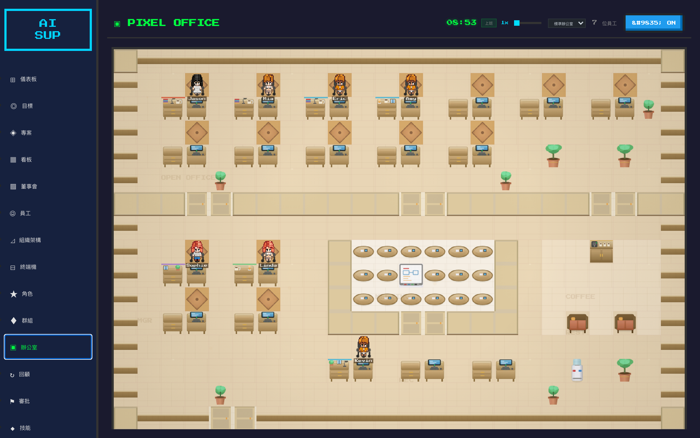
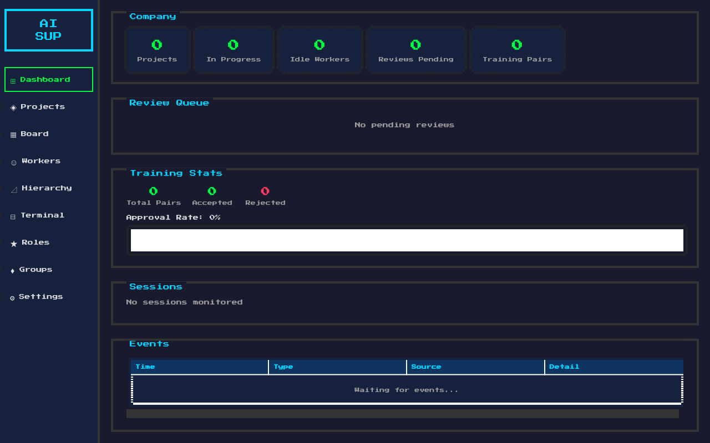
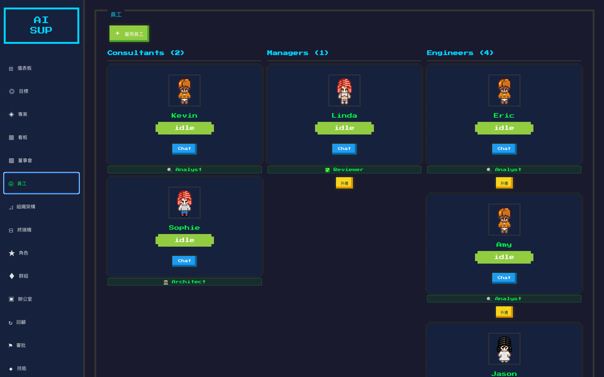
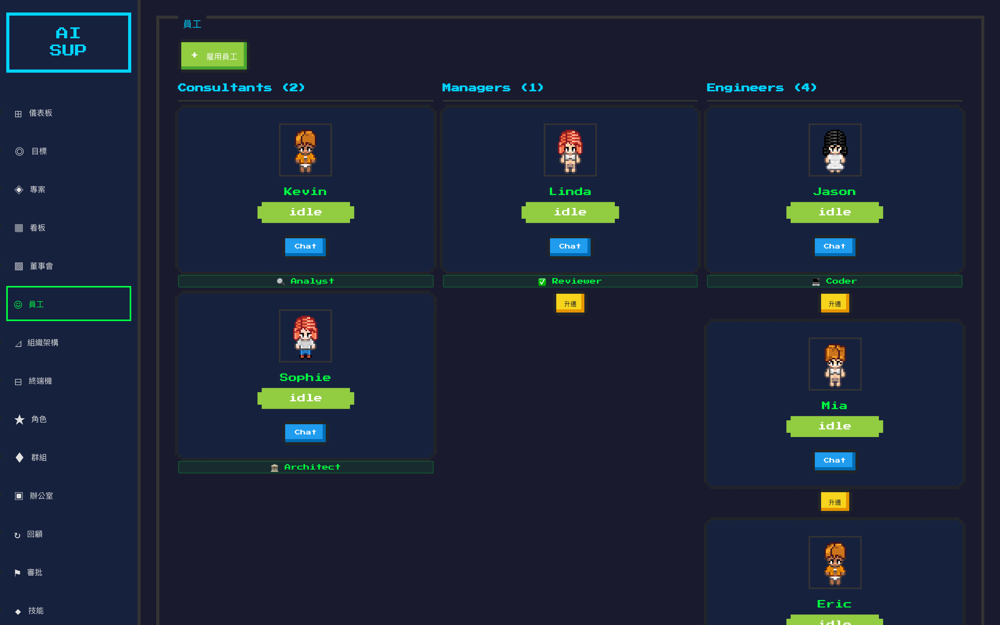
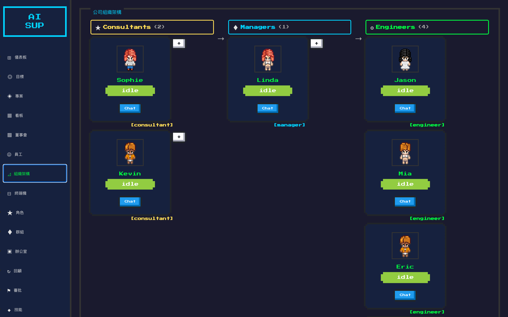
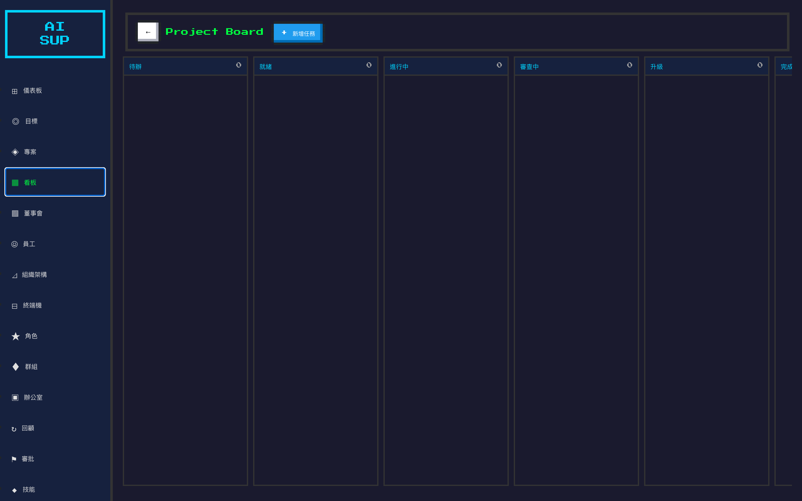
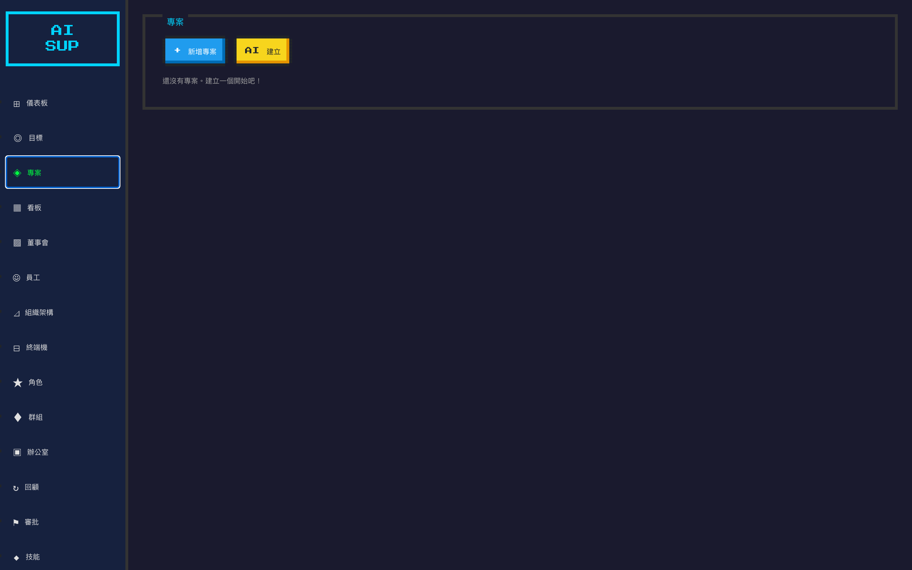
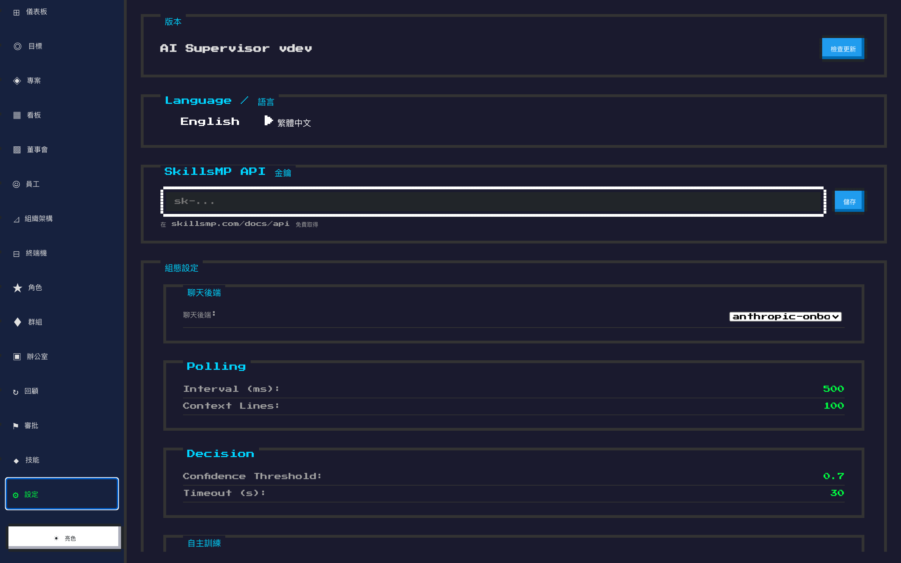

# AI Supervisor

[English](#english) | [繁體中文](#繁體中文)



---

## English

> A virtual office desktop app that manages AI workers — hire, assign tasks, review code, and watch your AI team collaborate in real time.

### What is AI Supervisor?

AI Supervisor is a **Wails v2 desktop application** (Go + Svelte) that turns AI coding assistants into a managed team of virtual employees. Think of it as a pixel-art office simulator where each "worker" is a real AI agent (Claude Code CLI) running in its own tmux session, writing actual code on your projects.

You are the boss. You hire workers, assign tasks, and they autonomously write code, create branches, submit for review, and iterate based on feedback — all while you watch from a retro-styled dashboard.

### Key Features

- **Guided Onboarding** — A conversational setup wizard helps you build your first AI team, complete with an HR specialist who recommends the right roles
- **Worker Management** — Hire AI workers with different skill profiles (coder, architect, QA, security, devops, designer, analyst, reviewer) and tiers (engineer, manager, consultant)
- **Task Pipeline** — Assign coding/research tasks to workers; each task gets its own git branch (optionally isolated in a git worktree) for safe parallel work
- **Automated Code Review** — Completed tasks are automatically routed to a reviewer worker; approved code gets merged
- **Carmack-Council Review** — Multi-expert review pipeline: parallel domain experts (security, performance, testing, frontend, backend, …) produce findings, a Carmack filter suppresses noise, and a unified verdict is surfaced for the reviewer to act on
- **Inter-Worker Communication** — Workers message each other via a persistent mailbox (YAML-backed), with synchronous ASK/REPLY for blocking questions that must be answered before work resumes
- **Structured Meetings** — Built-in Review / Planning / Debug meeting scenarios orchestrate multi-participant conversations, capturing minutes and action items
- **Pluggable Agent Backends** — Spawn workers with Claude Code CLI, `ais-agent`, or Aider via a unified `AgentRuntime` plugin interface; swap backends per worker without touching the spawner
- **Company Hierarchy** — Organize workers into teams with managers and consultants overseeing engineers
- **Personality System** — Each worker has unique personality traits, skill scores, moods, and relationships that evolve over time
- **AI-Generated Narratives** — Generate backstories and personality descriptions for your workers using AI
- **Training Loop** — Agentic training pipeline for autonomous code iteration and model fine-tuning
- **Multi-Backend Chat Providers** — Narrator, HR, and council use Anthropic API, Claude Code CLI, OpenAI, Ollama, or Google Gemini interchangeably
- **Pixel Office** — A virtual office view where you can see your workers at their desks
- **Bilingual UI** — Full support for English and 繁體中文 (Traditional Chinese)

### Screenshots

| Pixel Office | Dashboard |
|:------------:|:---------:|
|  |  |

| Workers | Worker Detail |
|:-------:|:-------------:|
|  |  |

| Hierarchy | Kanban Board |
|:---------:|:------------:|
|  |  |

| Projects | Settings |
|:--------:|:--------:|
|  |  |

### How It Works

```
You (the Boss)
  │
  ├── Create a Project (linked to a git repo)
  ├── Break it into Tasks (code, research, review)
  └── AI Workers pick up tasks autonomously
        │
        ├── Each worker runs an agent runtime (Claude Code / ais-agent / Aider) in a tmux pane
        ├── Creates a git branch per task (and optionally a git worktree for isolation)
        ├── Writes code, runs tests
        ├── Asks teammates via ASK/REPLY when blocked
        ├── Submits for code review (reviewer worker + optional Carmack-Council)
        └── Approved → merged; Rejected → iterate with reviewer feedback
```

### Tech Stack

| Layer | Technology |
|-------|-----------|
| Backend | Go 1.23+, Wails v2 |
| Frontend | Svelte + Vite, NES.css (retro pixel theme) |
| AI Workers | Agent runtimes (Claude Code CLI / ais-agent / Aider) in tmux sessions |
| Multi-Expert Review | Carmack-Council pipeline (parallel experts + Carmack filter) |
| Inter-Worker Messaging | Mailbox (YAML) + synchronous ASK/REPLY |
| Data Storage | YAML files (`~/.local/share/aisupervisor/company/`) |
| Configuration | `~/.config/aisupervisor/config.yaml` |

### Getting Started

#### Prerequisites

- **Go 1.23+**
- **Node.js 18+**
- **[Wails v2](https://wails.io/)** — `go install github.com/wailsapp/wails/v2/cmd/wails@latest`
- **tmux** — `brew install tmux` (macOS)
- **Claude Code CLI** — or another supported AI backend

#### Build & Run

```bash
# Development (hot-reload for frontend)
cd cmd/aisupervisor-gui && wails dev

# Production build
wails build

# Build + install on macOS
make install-mac
```

#### Configuration

On first launch, the onboarding wizard will guide you through setup. You can also manually configure:

```yaml
# ~/.config/aisupervisor/config.yaml
backends:
  - name: anthropic
    provider: anthropic
    apiKey: sk-ant-...
    model: claude-sonnet-4-20250514

polling:
  intervalMs: 500
  contextLines: 100
```

### Architecture

```
cmd/
  aisupervisor-gui/   # Wails v2 GUI entry point
  aisupervisor/       # TUI entry point (terminal mode)
internal/
  agent/              # AgentRuntime plugin system: interface + registry
    runtimeutil/      # Shared helpers (shellEscape, token parsing, session naming)
    claudecode/       # Claude Code CLI runtime
    aisagent/         # ais-agent runtime
    aider/            # Aider runtime
  ai/                 # Chat provider abstraction (anthropic, openai, ollama, gemini, claudecli)
  company/            # Core business logic — task management, review pipeline, meetings, council, mailbox
  config/             # App config + skill profiles
  gitops/             # Git branch/worktree operations for task isolation
  gui/                # Wails bindings (Go ↔ Svelte bridge)
  knowledge/          # Code graph, convention store, knowledge injection
  messaging/          # Inter-worker messaging primitives
  personality/        # Worker personality traits, skill scores, narratives
  project/            # Project & Task data models
  supervisor/         # Pane monitoring, activity observation
  tmux/               # tmux client (exec-based) for managing AI sessions
  worker/             # Worker spawner, monitor, session management
frontend/
  src/lib/
    components/       # Svelte UI components
    office/           # Pixel office simulation
    pages/            # Route pages
    stores/           # Svelte stores + i18n
```

#### AgentRuntime plugin contract

```
AgentRuntime interface
  ├── Name() / MonitoredSessionType()
  ├── Spawn(ctx, SpawnConfig) → *AgentSession
  ├── DetectReady(ctx, session, timeout)      // wait for CLI prompt
  ├── SendPrompt(session, prompt)             // deliver user input
  ├── CaptureOutput(session, lines)           // read pane buffer
  ├── DetectCompletion(ctx, session, content) // pure check over captured content
  ├── ParseTokenUsage(output) → TokenUsage
  └── Cleanup(session)                        // tear down tmux session

RuntimeRegistry (thread-safe, insertion-order-preserving)
  └── Manager.New() registers claude, ais-agent, aider plugins
     └── Spawner / CompletionMonitor / CouncilEngine / MeetingEngine all consult it
```

### Documentation

- [Product PRD](docs/product/aisupervisor-prd.md) — AI Supervisor product direction, MVP scope, and commercial readiness bar
- [Installation Guide](INSTALL.md) — User installation & developer build guide
- [GUI Manual](docs/GUI-MANUAL.md) — Complete UI operation manual
- [Docker Guide](docker/README.md) — Docker development environment
- [Case Studies](docs/case-studies/README.md) — Worked examples of external projects AI Supervisor agents can plan and build (LINE Wi-Fi Ad SaaS is one such example, not a template customers need to follow)

---

## 繁體中文

> 一款管理 AI 員工的虛擬辦公室桌面應用程式 — 招募、分配任務、審查程式碼，即時觀看你的 AI 團隊協作。

### 什麼是 AI Supervisor？

AI Supervisor 是一個 **Wails v2 桌面應用程式**（Go + Svelte），將 AI 程式助手轉化為一支受管理的虛擬員工團隊。可以把它想像成一個像素風格的辦公室模擬器，每位「員工」都是運行在獨立 tmux session 中的真實 AI 代理（Claude Code CLI），在你的專案中撰寫實際的程式碼。

你就是老闆。你招募員工、分配任務，他們會自主地撰寫程式碼、建立分支、提交審查、根據回饋迭代 — 而你在復古風格的儀表板上觀看一切。

### 主要功能

- **引導式入職** — 對話式設定精靈幫你建立第一支 AI 團隊，配備 HR 專員推薦適合的角色
- **員工管理** — 招募不同技能配置的 AI 員工（工程師、架構師、QA、安全、DevOps、設計師、分析師、審查員）和層級（工程師、管理者、顧問）
- **任務流水線** — 為員工分配程式/研究任務；每個任務都有獨立的 git 分支（可選 git worktree 隔離），支援安全的並行作業
- **自動程式碼審查** — 完成的任務自動轉給審查員；通過的程式碼自動合併
- **Carmack-Council 多專家審查** — 並行領域專家（安全、效能、測試、前端、後端…）各自提出 findings，經 Carmack filter 去蕪存菁，最終合併出一致 verdict
- **員工間通訊** — 員工透過持久化 mailbox（YAML）互相留言；支援同步 ASK/REPLY，工作中可阻塞等待回應後再繼續
- **結構化會議** — 內建 Review / Planning / Debug 三種會議場景，協調多方對話並自動生成會議紀錄與行動項目
- **可插拔 Agent 後端** — 透過統一的 `AgentRuntime` plugin interface 支援 Claude Code CLI、`ais-agent`、Aider；可按員工切換後端，無需修改 spawner
- **公司層級** — 將員工組織成團隊，管理者和顧問監督工程師
- **性格系統** — 每位員工都有獨特的性格特質、技能分數、心情和人際關係，會隨時間演變
- **AI 生成敘事** — 使用 AI 為員工生成背景故事和性格描述
- **訓練迴圈** — 自主訓練管線，用於程式碼迭代和模型微調
- **多後端 Chat Provider** — Narrator / HR / Council 皆可選 Anthropic API、Claude Code CLI、OpenAI、Ollama 或 Google Gemini
- **像素辦公室** — 虛擬辦公室視圖，看到你的員工在桌前工作
- **雙語介面** — 完整支援 English 和繁體中文

### 運作方式

```
你（老闆）
  │
  ├── 建立專案（連結 git 倉庫）
  ├── 拆分為任務（程式、研究、審查）
  └── AI 員工自主領取任務
        │
        ├── 每位員工在 tmux pane 中運行 agent runtime（Claude Code / ais-agent / Aider）
        ├── 為每個任務建立 git 分支（可選 git worktree 隔離）
        ├── 撰寫程式碼、執行測試
        ├── 卡關時透過 ASK/REPLY 向同事發問
        ├── 提交程式碼審查（審查員 + 可選的 Carmack-Council 多專家）
        └── 通過 → 合併；退回 → 依審查回饋迭代
```

### 技術架構

| 層級 | 技術 |
|------|------|
| 後端 | Go 1.23+, Wails v2 |
| 前端 | Svelte + Vite, NES.css（復古像素主題）|
| AI 員工 | Agent runtimes（Claude Code CLI / ais-agent / Aider）於 tmux sessions 中執行 |
| 多專家審查 | Carmack-Council pipeline（parallel experts + Carmack filter）|
| 員工通訊 | Mailbox（YAML）+ 同步 ASK/REPLY |
| 資料儲存 | YAML 檔案（`~/.local/share/aisupervisor/company/`）|
| 設定檔 | `~/.config/aisupervisor/config.yaml` |

### 快速開始

#### 前置需求

- **Go 1.23+**
- **Node.js 18+**
- **[Wails v2](https://wails.io/)** — `go install github.com/wailsapp/wails/v2/cmd/wails@latest`
- **tmux** — `brew install tmux`（macOS）
- **Claude Code CLI** — 或其他支援的 AI 後端

#### 建置與執行

```bash
# 開發模式（前端熱更新）
cd cmd/aisupervisor-gui && wails dev

# 正式建置
wails build

# macOS 建置 + 安裝
make install-mac
```

#### 設定

首次啟動時，入職精靈會引導你完成設定。也可以手動設定：

```yaml
# ~/.config/aisupervisor/config.yaml
backends:
  - name: anthropic
    provider: anthropic
    apiKey: sk-ant-...
    model: claude-sonnet-4-20250514

polling:
  intervalMs: 500
  contextLines: 100
```

### 相關文件

- [產品 PRD](docs/product/aisupervisor-prd.md) — AI Supervisor 本體方向、MVP 範圍與商業化成熟度門檻
- [安裝手冊](INSTALL.md) — 使用者安裝與開發者建置指南
- [GUI 操作手冊](docs/GUI-MANUAL.md) — 完整 UI 操作手冊
- [Docker 指南](docker/README.md) — Docker 開發環境
- [案例研究](docs/case-studies/README.md) — AI Supervisor agents 可規劃並執行的外部專案範例（LINE Wi-Fi Ad SaaS 為其中一例，並非客戶必須套用的模板）

---

## License

This project is proprietary software. All rights reserved.
