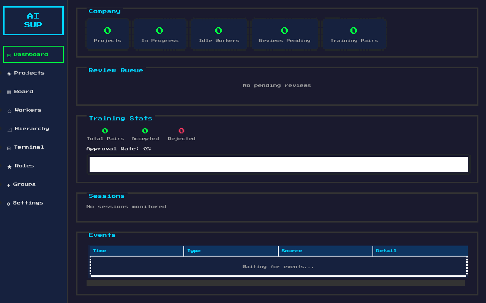
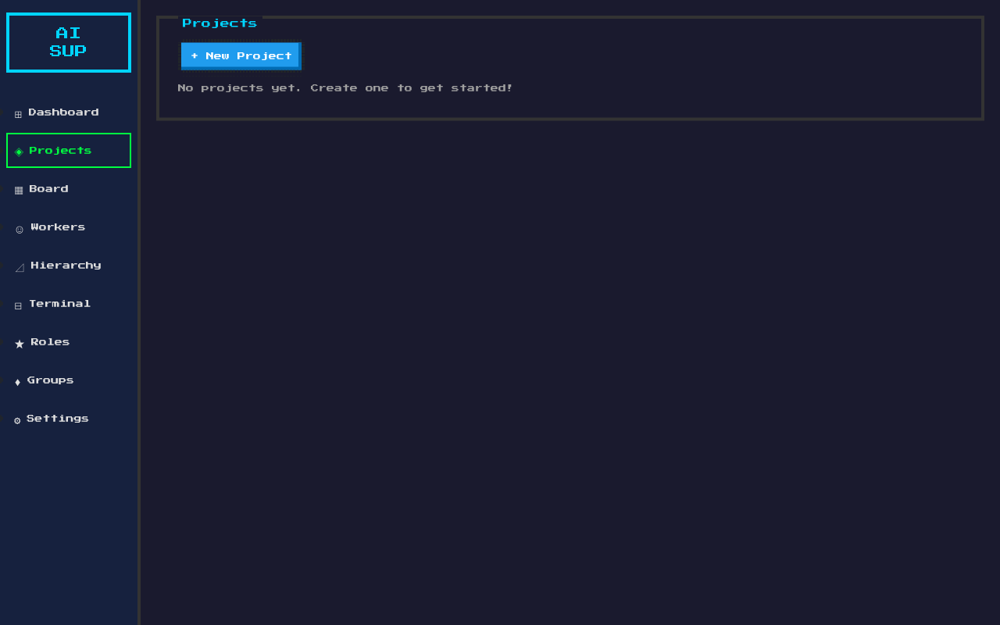
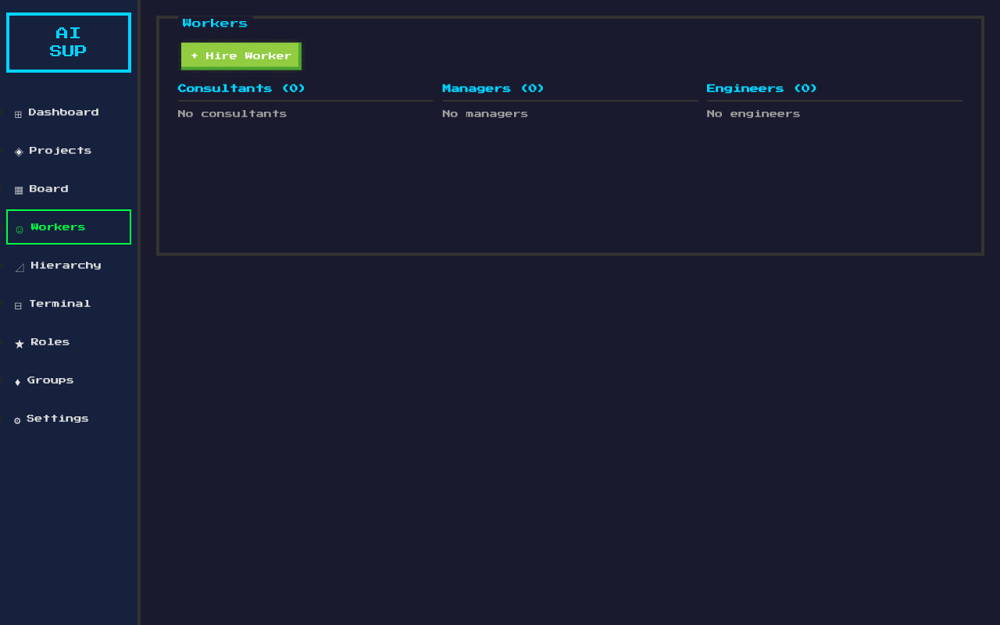
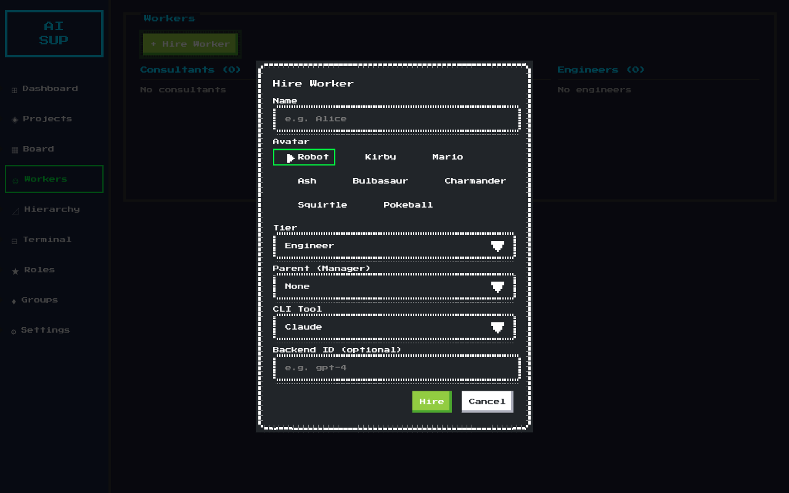
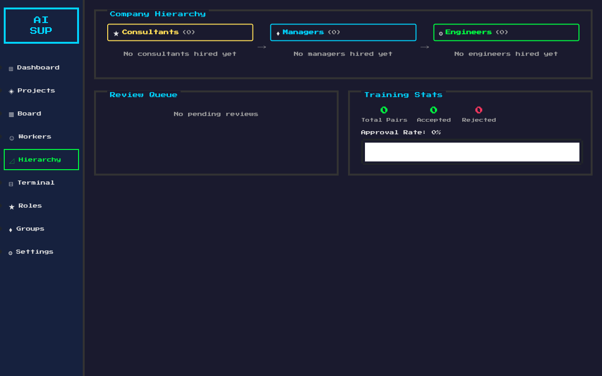
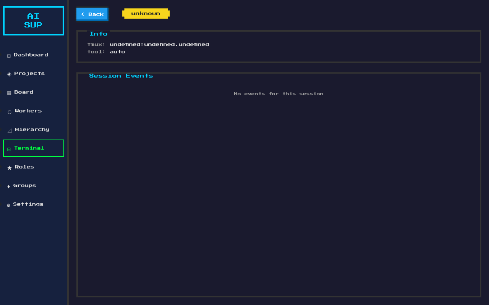
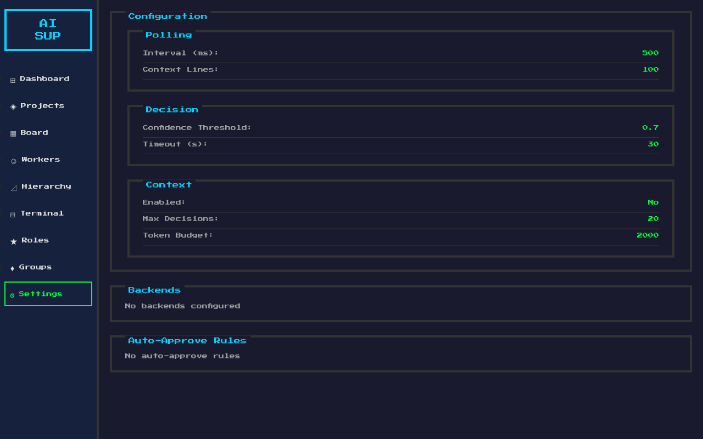

# AI Supervisor GUI 操作手冊

AI Supervisor 是一套 8-bit 復古風格的 AI 公司管理系統，使用 Wails (Go) + Svelte 4 + NES.css 打造。本手冊涵蓋所有 GUI 頁面的功能與操作方式。

---

## 目錄

1. [啟動應用程式](#1-啟動應用程式)
2. [Dashboard（儀表板）](#2-dashboard儀表板)
3. [Projects（專案管理）](#3-projects專案管理)
4. [Board（看板）](#4-board看板)
5. [Workers（員工管理）](#5-workers員工管理)
6. [Hierarchy（階層視圖）](#6-hierarchy階層視圖)
7. [Terminal（終端機）](#7-terminal終端機)
8. [Roles（角色管理）](#8-roles角色管理)
9. [Groups（群組討論）](#9-groups群組討論)
10. [Settings（設定）](#10-settings設定)

---

## 1. 啟動應用程式

### 前置需求
- Go 1.21+
- Node.js 18+
- tmux（需在背景執行）
- Wails CLI v2（`go install github.com/wailsapp/wails/v2/cmd/wails@latest`）

### 啟動方式

**開發模式**（前端即時更新）：
```bash
cd cmd/aisupervisor-gui
~/go/bin/wails dev
```

**正式建構**：
```bash
cd cmd/aisupervisor-gui
~/go/bin/wails build
./build/bin/aisupervisor-gui
```

### 啟動參數
| 參數 | 說明 | 範例 |
|------|------|------|
| `-config` | 指定設定檔路徑 | `-config ~/.config/aisupervisor/config.yaml` |
| `-session` | 監控特定 tmux session | `-session mysession:0.0` |
| `-backend` | 覆蓋預設 AI 後端 | `-backend anthropic` |
| `-dry-run` | 偵測與決策但不送出按鍵 | `-dry-run` |

---

## 2. Dashboard（儀表板）



Dashboard 是應用程式的首頁，提供公司整體運作狀態的即時概覽。

### Company 統計卡片
頂部顯示 5 張統計卡片：
- **Projects** — 目前專案總數
- **In Progress** — 進行中的專案數量
- **Idle Workers** — 閒置員工數量
- **Reviews Pending** — 待審核的 code review 數量
- **Training Pairs** — 訓練資料對數

這些數據會在任何公司事件發生時自動刷新。

### Review Queue
顯示目前待審核的 review 列表，以表格呈現：
- Task（任務名稱）
- Project（所屬專案）
- Engineer（負責工程師）
- Manager（審核管理者）
- Created（建立時間）

若無待審項目，顯示「No pending reviews」。

### Training Stats
顯示模型訓練資料的統計：
- **Total Pairs** — 訓練對數總量
- **Accepted** — 已接受的對數（綠色）
- **Rejected** — 已拒絕的對數（紅色）
- **Approval Rate** — 通過率進度條
  - 80%+ 綠色、50-80% 黃色、<50% 紅色

### Sessions
列出所有被監控的 tmux sessions。點擊任一 session 卡片可跳轉至 Terminal 頁面查看詳情。

### Events
底部的事件日誌表格，顯示最近 200 筆 Supervisor 和 Company 事件。欄位：
- Time（時間戳）
- Type（事件類型，如 DETECT、DECIDE、HIRE、COMMIT 等）
- Source（來源）
- Detail（詳細內容）

### 低信心確認對話框
當 Supervisor 偵測到低信心度的決策（低於設定的 threshold）時，會自動彈出確認對話框，顯示：
- Session 名稱
- 建議動作
- 理由與信心百分比
- **Approve** / **Dismiss** 按鈕

---

## 3. Projects（專案管理）



管理 AI 公司中的所有軟體專案。

### 建立新專案
1. 點擊 **+ New Project** 按鈕
2. 填寫表單：
   - **Name** — 專案名稱
   - **Description** — 專案描述
   - **Repo Path** — Git 倉庫路徑
   - **Base Branch** — 基礎分支（如 `main`）
   - **Goals** — 專案目標（每行一個）
3. 點擊 **Create** 送出

### 專案列表
每張專案卡片顯示：
- 專案名稱與狀態
- 描述
- 點擊卡片可進入 Board 看板頁面

---

## 4. Board（看板）

看板頁面以 Kanban 風格展示指定專案的任務流程。

### 看板欄位
- **Ready** — 已就緒、待分配的任務
- **In Progress** — 進行中的任務
- **Review** — 待審核的任務
- **Done** — 已完成的任務

### 建立任務
1. 點擊 **+ New Task** 按鈕
2. 填寫表單：
   - **Title** — 任務標題
   - **Description** — 任務描述
   - **Prompt** — 給 Claude Code 的指令
   - **Priority** — 優先級（1-9，1 最高）
   - **Milestone** — 里程碑（選填）
   - **Dependencies** — 依賴的前置任務
3. 點擊 **Create** 送出

### 任務操作
- **Assign**（在 Ready 狀態）— 將任務指派給閒置的 Worker
- **Done**（在 Review 狀態）— 標記任務完成
- 任務卡片顯示優先級 badge（P1-P3）、分配者、分支狀態

---

## 5. Workers（員工管理）



Workers 頁面以 3 欄階層視圖展示所有 AI 員工。

### 三層架構
| 欄位 | 說明 |
|------|------|
| **Consultants** | 最高層級，負責策略與最終決策 |
| **Managers** | 中間層級，負責 code review 和任務管理 |
| **Engineers** | 執行層級，負責實際撰寫程式碼 |

每欄標題顯示 tier 名稱與該層人數。

### Worker 卡片
每張卡片包含：
- **Avatar** — NES.css 像素角色圖示
- **Name** — 員工名稱
- **Status Badge** — 狀態指示
  - 🟢 idle（閒置）
  - 🔵 working（工作中）
  - 🟡 waiting（等待中）
  - 🔴 error（錯誤）
- **Current Task** — 目前執行的任務 ID
- **Parent Link** — 上級管理者名稱（如「↑ Manager: Alice」）
- **Promote 按鈕** — 將員工升級到下一個 tier

### 點擊 Worker → Log Panel
點擊任一 Worker 卡片會彈出 Log Panel 對話框：
- 85vw x 80vh 的大型終端機風格視窗
- 即時顯示該 Worker 的執行日誌
- 搜尋過濾功能
- 可調整 scrollback 行數（100-1000）
- 每 1.5 秒自動刷新

### 招募新員工



1. 點擊 **+ Hire Worker** 按鈕
2. 填寫表單：
   - **Name** — 員工名稱
   - **Avatar** — 選擇像素角色（Robot, Kirby, Mario, Ash, Bulbasaur, Charmander, Squirtle, Pokeball）
   - **Tier** — 選擇層級（Consultant / Manager / Engineer）
   - **Parent (Manager)** — 選擇上級管理者（下拉選單列出所有 Consultant 和 Manager）
   - **CLI Tool** — 選擇使用的 AI 工具（Claude / Codex / Gemini）
   - **Backend ID** — 選填，指定後端模型 ID（如 `gpt-4`）
3. 點擊 **Hire** 完成招募

### 升級員工
- Engineer → Manager → Consultant
- 在 Worker 卡片上點擊 **Promote** 按鈕即可升級
- Consultant 已是最高層級，不顯示 Promote 按鈕

---

## 6. Hierarchy（階層視圖）



Hierarchy 頁面是專門的全頁階層視覺化頁面，提供更詳細的公司組織結構。

### 階層欄位
以三欄橫向排列，中間有箭頭（→）表示指揮鏈：

| 欄位 | 圖示 | 顏色 |
|------|------|------|
| Consultants | ★ | 黃色 |
| Managers | ♦ | 藍色 |
| Engineers | ⚙ | 綠色 |

每個 tier 都有彩色邊框的 badge 標頭，顯示圖示、名稱和人數。

### Worker 卡片
與 Workers 頁面相同，但額外顯示：
- **Tier Badge** — 以 tier 顏色標示 `[consultant]` / `[manager]` / `[engineer]`
- **Parent Name** — 顯示上級名稱（如「↑ Alice」）

點擊卡片同樣可以開啟 Log Panel。

### 底部面板
頁面底部並排顯示兩個面板：
- **Review Queue** — 與 Dashboard 相同的待審核列表
- **Training Stats** — 與 Dashboard 相同的訓練統計

---

## 7. Terminal（終端機）



Terminal 頁面顯示特定 tmux session 的詳細資訊。

### 導航
- 從 Dashboard 點擊 session 卡片進入
- 點擊 **< Back** 按鈕返回 Dashboard

### 資訊區
- **tmux** — 顯示 session:window.pane 格式
- **tool** — 使用的工具類型

### Session Events
顯示該 session 的事件歷程（偵測、決策、送出等）。

---

## 8. Roles（角色管理）

管理 Supervisor 的 AI 決策角色。

### 角色系統
每個角色有不同的職責和決策模式：
- **Gatekeeper** — 把關者，判斷是否批准動作
- **Manager** — 管理者，策略級決策
- 自訂角色 — 透過 config 或 `~/.config/aisupervisor/roles/` 目錄載入

### Session 角色指派
1. 選擇一個 Session
2. 勾選要啟用的角色
3. 角色會以其 mode（observe / intervene）和 priority 參與決策

---

## 9. Groups（群組討論）

當偵測到需要多角色討論的情境時，Groups 頁面顯示 AI 群組討論的完整流程。

### 三階段討論
1. **Opinion** — 各角色提出初步意見
2. **Roundtable** — 圓桌討論，角色之間交換看法
3. **Decision** — 最終決策

### 討論訊息
每則訊息包含：
- 角色名稱與圖示
- 信心度百分比（紅 <50% / 黃 50-80% / 綠 80%+）
- 階段標籤
- 建議動作 badge

---

## 10. Settings（設定）



唯讀顯示目前的 Supervisor 設定值。

### Polling（輪詢）
- **Interval (ms)** — 輪詢間隔，預設 500ms
- **Context Lines** — 每次讀取的上下文行數，預設 100

### Decision（決策）
- **Confidence Threshold** — 信心度門檻，低於此值需人工確認，預設 0.7
- **Timeout (s)** — 決策超時秒數，預設 30

### Context（上下文記憶）
- **Enabled** — 是否啟用上下文記憶
- **Max Decisions** — 記憶的最大決策數，預設 20
- **Token Budget** — Token 預算，預設 2000

### Backends
列出已設定的 AI 後端（Anthropic、OpenAI、Gemini、Ollama）。

### Auto-Approve Rules
列出自動批准規則，符合規則的動作無需人工確認。

---

## 側邊欄導航

左側的側邊欄提供快速導航，包含 9 個頁面入口：

| 圖示 | 頁面 | 說明 |
|------|------|------|
| ⊞ | Dashboard | 總覽儀表板 |
| ◈ | Projects | 專案管理 |
| ▦ | Board | 任務看板 |
| ☺ | Workers | 員工管理（階層視圖） |
| ⊿ | Hierarchy | 公司階層視覺化 |
| ⊟ | Terminal | 終端機詳情 |
| ★ | Roles | 角色管理 |
| ♦ | Groups | 群組討論 |
| ⚙ | Settings | 系統設定 |

目前所在的頁面會以綠色邊框高亮顯示。

---

## 即時事件系統

所有頁面透過 Wails Runtime Events 接收即時更新：

| 事件 | 說明 |
|------|------|
| `company:event` | 公司事件（專案、任務、員工變動） |
| `supervisor:error` | Supervisor 錯誤通知 |
| `supervisor:event` | Supervisor 事件（偵測、決策） |
| `discussion:event` | 群組討論事件 |

事件觸發時，相關的 store 會自動重新載入資料，確保 UI 始終顯示最新狀態。錯誤事件會以 Toast 通知的方式在右上角短暫顯示。

---

## 鍵盤快捷鍵

| 按鍵 | 功能 |
|------|------|
| `Enter` | 觸發選取的 sidebar 項目 |
| `Escape` | 關閉任何開啟的 dialog |

---

## 技術架構

```
┌─────────────────────────────────────────────┐
│              Wails Desktop App              │
├──────────────┬──────────────────────────────┤
│  Go Backend  │      Svelte Frontend         │
│              │                              │
│  CompanyApp  │  Stores (reactive)           │
│  - Workers   │  - workers.js + hierarchy    │
│  - Projects  │  - company.js + reviewQueue  │
│  - Tasks     │  - sessions.js              │
│  - Hierarchy │  - events.js                │
│  - Reviews   │  - roles.js                 │
│  - Training  │  - discussions.js           │
│              │                              │
│  App         │  Pages                       │
│  - Sessions  │  - DashboardPage            │
│  - Roles     │  - WorkersPage              │
│  - Groups    │  - HierarchyPage            │
│  - Events    │  - ProjectsPage             │
│              │  - ProjectBoardPage          │
│  tmux ←→ AI  │  - TerminalPage             │
│              │  - RolesPage                 │
│              │  - GroupsPage               │
│              │  - SettingsPage             │
├──────────────┴──────────────────────────────┤
│          NES.css (8-bit Retro Theme)        │
└─────────────────────────────────────────────┘
```
