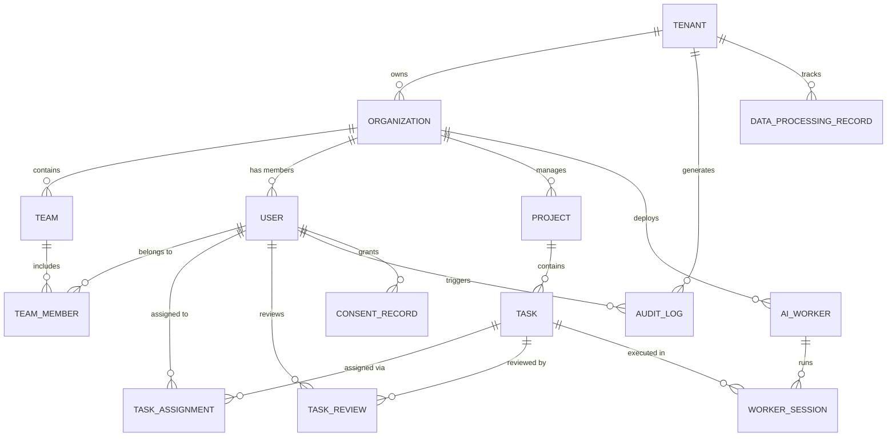

# PRD：數據結構設計專案 — 多租戶資料庫 ER 圖

| 欄位       | 內容                                   |
|-----------|---------------------------------------|
| 文件版本   | 1.0                                   |
| 建立日期   | 2026-04-07                            |
| 專案名稱   | 數據結構設計專案                         |
| 負責人     | Product Team                          |
| 狀態       | Draft                                 |

---

## 1. 概述

本專案旨在為 aisupervisor 平台設計一套支援多租戶（multi-tenancy）的資料庫實體關聯（ER）模型，確保租戶間數據完全隔離、符合 GDPR 規範，並具備水平擴展能力。

### 1.1 背景

aisupervisor 目前使用本地 YAML 檔案儲存公司與任務資料（`~/.local/share/aisupervisor/company/`）。隨著產品擴展至多組織/多團隊場景，需要一套結構化的資料庫架構來支援：

- 多個組織同時使用平台，彼此數據隔離
- 符合歐盟 GDPR 及相關隱私法規
- 支撐未來 SaaS 化部署

### 1.2 目標

1. 完成多租戶支持的資料庫 ER 圖設計
2. 提交並驗證實體關聯的完整性測試報告
3. 確保所有核心數據模型遵循 GDPR 標準

### 1.3 成功指標

| 指標                        | 目標值               |
|----------------------------|---------------------|
| 租戶數據隔離驗證通過率        | 100%                |
| ER 圖覆蓋核心業務實體數量     | >= 12 個實體          |
| GDPR 合規檢查項通過率        | 100%                |
| 查詢效能（單租戶 CRUD）      | p99 < 50ms          |
| 參照完整性約束覆蓋率          | 100% 外鍵關聯        |

---

## 2. 市場分析

### 2.1 目標用戶

| 用戶角色           | 描述                                           | 核心需求                          |
|-------------------|-----------------------------------------------|----------------------------------|
| 平台管理員         | 管理多個租戶、監控資源用量                         | 租戶管理、用量儀表板、存取控制       |
| 組織管理員         | 單一組織內的團隊與 AI Worker 管理                  | 成員管理、任務分配、審核流程         |
| 開發者/AI 操作員   | 操作 AI Worker、提交任務、檢視結果                  | 任務 CRUD、Worker 狀態、輸出檢視    |
| 合規/安全官        | 確保平台符合 GDPR 及內部安全政策                    | 審計日誌、數據匯出/刪除、存取記錄    |

### 2.2 競爭分析

| 產品/方案                    | 多租戶策略             | 優勢                        | 劣勢                         |
|-----------------------------|----------------------|----------------------------|------------------------------|
| **AWS SageMaker**           | 帳號級隔離（silo）     | 完全隔離、AWS 生態整合        | 成本高、跨租戶協作困難          |
| **Weights & Biases**        | 共享資料庫 + org 隔離  | 輕量、快速上線               | 大規模租戶下效能瓶頸            |
| **Databricks Unity Catalog**| Schema-per-tenant    | 彈性、細粒度權限              | 運維複雜度高                   |
| **Retool**                  | Row-level security   | 成本低、單一 DB 維護簡單      | 應用層 bug 可能洩露數據         |

### 2.3 策略選擇

採用 **共享資料庫 + Schema 隔離（Shared DB, Separate Schema）** 混合 **Row-Level Security（RLS）** 的方案：

- 共用基礎設施，降低運維成本
- 透過 `tenant_id` 欄位 + RLS Policy 實現邏輯隔離
- 敏感資料（PII）加密儲存，支持 per-tenant encryption key
- 保留未來遷移至 schema-per-tenant 的能力

---

## 3. 核心數據模型（ER 設計）

### 3.1 實體總覽



### 3.2 實體定義

#### TENANT（租戶）

| 欄位                | 型別           | 約束                | 說明                      |
|--------------------|---------------|--------------------|--------------------------|
| id                 | UUID          | PK                 | 租戶唯一識別碼              |
| name               | VARCHAR(255)  | NOT NULL           | 租戶名稱                   |
| slug               | VARCHAR(100)  | UNIQUE, NOT NULL   | URL-safe 識別碼            |
| plan               | ENUM          | NOT NULL           | 訂閱方案（free/pro/enterprise） |
| encryption_key_ref | VARCHAR(512)  | NULL               | KMS key reference（per-tenant 加密） |
| data_region        | VARCHAR(50)   | NOT NULL           | 數據存放區域（GDPR 合規）    |
| status             | ENUM          | NOT NULL           | active / suspended / deleted |
| created_at         | TIMESTAMPTZ   | NOT NULL           | 建立時間                   |
| updated_at         | TIMESTAMPTZ   | NOT NULL           | 更新時間                   |
| deleted_at         | TIMESTAMPTZ   | NULL               | 軟刪除時間                  |

#### ORGANIZATION（組織）

| 欄位         | 型別           | 約束                     | 說明              |
|-------------|---------------|-------------------------|------------------|
| id          | UUID          | PK                      | 組織 ID           |
| tenant_id   | UUID          | FK → TENANT, NOT NULL   | 所屬租戶           |
| name        | VARCHAR(255)  | NOT NULL                | 組織名稱           |
| settings    | JSONB         | DEFAULT '{}'            | 組織級設定          |
| created_at  | TIMESTAMPTZ   | NOT NULL                | 建立時間           |
| updated_at  | TIMESTAMPTZ   | NOT NULL                | 更新時間           |

#### USER（使用者）

| 欄位                   | 型別           | 約束                         | 說明                       |
|-----------------------|---------------|-----------------------------|--------------------------|
| id                    | UUID          | PK                          | 使用者 ID                  |
| tenant_id             | UUID          | FK → TENANT, NOT NULL       | 所屬租戶（RLS 依據）         |
| organization_id       | UUID          | FK → ORGANIZATION, NOT NULL | 所屬組織                    |
| email                 | VARCHAR(320)  | NOT NULL                    | 電子信箱（加密儲存）          |
| email_hash            | VARCHAR(64)   | UNIQUE, NOT NULL            | Email SHA-256 hash（查詢用） |
| display_name          | VARCHAR(255)  | NOT NULL                    | 顯示名稱                    |
| role                  | ENUM          | NOT NULL                    | admin / member / viewer    |
| encrypted_pii         | BYTEA         | NULL                        | 加密的個人識別資訊            |
| consent_version       | VARCHAR(20)   | NULL                        | 最後同意的隱私政策版本         |
| data_retention_until  | TIMESTAMPTZ   | NULL                        | 數據保留期限（GDPR）         |
| last_login_at         | TIMESTAMPTZ   | NULL                        | 最後登入時間                 |
| created_at            | TIMESTAMPTZ   | NOT NULL                    | 建立時間                    |
| updated_at            | TIMESTAMPTZ   | NOT NULL                    | 更新時間                    |
| deleted_at            | TIMESTAMPTZ   | NULL                        | 軟刪除（right to erasure）  |

#### TEAM（團隊）

| 欄位              | 型別           | 約束                          | 說明         |
|------------------|---------------|------------------------------|------------|
| id               | UUID          | PK                           | 團隊 ID     |
| tenant_id        | UUID          | FK → TENANT, NOT NULL        | 所屬租戶     |
| organization_id  | UUID          | FK → ORGANIZATION, NOT NULL  | 所屬組織     |
| name             | VARCHAR(255)  | NOT NULL                     | 團隊名稱     |
| created_at       | TIMESTAMPTZ   | NOT NULL                     | 建立時間     |
| updated_at       | TIMESTAMPTZ   | NOT NULL                     | 更新時間     |

#### TEAM_MEMBER（團隊成員）

| 欄位         | 型別           | 約束                      | 說明               |
|-------------|---------------|--------------------------|------------------|
| id          | UUID          | PK                       | 記錄 ID            |
| tenant_id   | UUID          | FK → TENANT, NOT NULL    | 所屬租戶            |
| team_id     | UUID          | FK → TEAM, NOT NULL      | 所屬團隊            |
| user_id     | UUID          | FK → USER, NOT NULL      | 成員 ID            |
| role        | ENUM          | NOT NULL                 | lead / member     |
| created_at  | TIMESTAMPTZ   | NOT NULL                 | 加入時間            |

**約束**: UNIQUE(team_id, user_id)

#### PROJECT（專案）

| 欄位              | 型別           | 約束                          | 說明                   |
|------------------|---------------|------------------------------|----------------------|
| id               | UUID          | PK                           | 專案 ID               |
| tenant_id        | UUID          | FK → TENANT, NOT NULL        | 所屬租戶               |
| organization_id  | UUID          | FK → ORGANIZATION, NOT NULL  | 所屬組織               |
| name             | VARCHAR(255)  | NOT NULL                     | 專案名稱               |
| description      | TEXT          | NULL                         | 專案描述               |
| repo_url         | VARCHAR(2048) | NULL                         | Git 倉庫 URL          |
| status           | ENUM          | NOT NULL                     | active / archived     |
| created_at       | TIMESTAMPTZ   | NOT NULL                     | 建立時間               |
| updated_at       | TIMESTAMPTZ   | NOT NULL                     | 更新時間               |

#### TASK（任務）

| 欄位            | 型別           | 約束                       | 說明                                       |
|----------------|---------------|---------------------------|--------------------------------------------|
| id             | UUID          | PK                        | 任務 ID                                     |
| tenant_id      | UUID          | FK → TENANT, NOT NULL     | 所屬租戶                                     |
| project_id     | UUID          | FK → PROJECT, NOT NULL    | 所屬專案                                     |
| parent_task_id | UUID          | FK → TASK, NULL           | 父任務（review sub-task 等）                   |
| title          | VARCHAR(500)  | NOT NULL                  | 任務標題                                     |
| description    | TEXT          | NULL                      | 任務描述                                     |
| priority       | ENUM          | NOT NULL                  | critical / high / medium / low              |
| status         | ENUM          | NOT NULL                  | pending / assigned / in_progress / code_review / completed / failed |
| branch_name    | VARCHAR(255)  | NULL                      | Git 分支名稱                                  |
| created_at     | TIMESTAMPTZ   | NOT NULL                  | 建立時間                                     |
| updated_at     | TIMESTAMPTZ   | NOT NULL                  | 更新時間                                     |

#### TASK_ASSIGNMENT（任務指派）

| 欄位           | 型別           | 約束                       | 說明                |
|---------------|---------------|---------------------------|-------------------|
| id            | UUID          | PK                        | 記錄 ID            |
| tenant_id     | UUID          | FK → TENANT, NOT NULL     | 所屬租戶            |
| task_id       | UUID          | FK → TASK, NOT NULL       | 任務 ID            |
| user_id       | UUID          | FK → USER, NULL           | 指派的使用者         |
| ai_worker_id  | UUID          | FK → AI_WORKER, NULL      | 指派的 AI Worker    |
| assigned_at   | TIMESTAMPTZ   | NOT NULL                  | 指派時間            |

**約束**: CHECK(user_id IS NOT NULL OR ai_worker_id IS NOT NULL)

#### TASK_REVIEW（任務審核）

| 欄位          | 型別           | 約束                       | 說明                        |
|--------------|---------------|---------------------------|-----------------------------|
| id           | UUID          | PK                        | 審核記錄 ID                  |
| tenant_id    | UUID          | FK → TENANT, NOT NULL     | 所屬租戶                     |
| task_id      | UUID          | FK → TASK, NOT NULL       | 被審核任務                    |
| reviewer_id  | UUID          | FK → USER, NULL           | 審核者（人類）                 |
| ai_worker_id | UUID          | FK → AI_WORKER, NULL      | 審核者（AI）                  |
| verdict      | ENUM          | NOT NULL                  | approved / rejected / pending |
| comment      | TEXT          | NULL                      | 審核意見                      |
| reviewed_at  | TIMESTAMPTZ   | NOT NULL                  | 審核時間                      |

#### AI_WORKER（AI 工作者）

| 欄位              | 型別           | 約束                          | 說明                             |
|------------------|---------------|------------------------------|--------------------------------|
| id               | UUID          | PK                           | Worker ID                       |
| tenant_id        | UUID          | FK → TENANT, NOT NULL        | 所屬租戶                         |
| organization_id  | UUID          | FK → ORGANIZATION, NOT NULL  | 所屬組織                         |
| name             | VARCHAR(255)  | NOT NULL                     | Worker 名稱                      |
| skill_profile    | VARCHAR(100)  | NOT NULL                     | 技能配置（對應 config/defaults.go）|
| model            | VARCHAR(100)  | NOT NULL                     | AI 模型 ID                       |
| status           | ENUM          | NOT NULL                     | idle / busy / offline            |
| config           | JSONB         | DEFAULT '{}'                 | Worker 級設定                     |
| created_at       | TIMESTAMPTZ   | NOT NULL                     | 建立時間                          |
| updated_at       | TIMESTAMPTZ   | NOT NULL                     | 更新時間                          |

#### WORKER_SESSION（工作階段）

| 欄位            | 型別           | 約束                        | 說明                           |
|----------------|---------------|-----------------------------|------------------------------|
| id             | UUID          | PK                          | 階段 ID                       |
| tenant_id      | UUID          | FK → TENANT, NOT NULL       | 所屬租戶                       |
| ai_worker_id   | UUID          | FK → AI_WORKER, NOT NULL    | 執行的 Worker                  |
| task_id        | UUID          | FK → TASK, NULL             | 關聯任務                       |
| tmux_session   | VARCHAR(255)  | NULL                        | tmux session 名稱              |
| tmux_pane      | VARCHAR(50)   | NULL                        | tmux pane ID                  |
| status         | ENUM          | NOT NULL                    | running / completed / failed   |
| started_at     | TIMESTAMPTZ   | NOT NULL                    | 開始時間                       |
| ended_at       | TIMESTAMPTZ   | NULL                        | 結束時間                       |
| output_hash    | VARCHAR(64)   | NULL                        | 輸出內容 hash（完整性驗證）      |

#### AUDIT_LOG（審計日誌）

| 欄位          | 型別           | 約束                       | 說明                              |
|--------------|---------------|---------------------------|----------------------------------|
| id           | UUID          | PK                        | 日誌 ID                           |
| tenant_id    | UUID          | FK → TENANT, NOT NULL     | 所屬租戶                           |
| user_id      | UUID          | FK → USER, NULL           | 操作者                             |
| action       | VARCHAR(100)  | NOT NULL                  | 操作類型（CREATE/READ/UPDATE/DELETE）|
| entity_type  | VARCHAR(100)  | NOT NULL                  | 操作對象類型                        |
| entity_id    | UUID          | NOT NULL                  | 操作對象 ID                         |
| old_value    | JSONB         | NULL                      | 變更前值                            |
| new_value    | JSONB         | NULL                      | 變更後值                            |
| ip_address   | INET          | NULL                      | 來源 IP                            |
| created_at   | TIMESTAMPTZ   | NOT NULL                  | 事件時間                            |

**注意**: AUDIT_LOG 為 append-only，不支援 UPDATE/DELETE 操作。

#### CONSENT_RECORD（同意記錄 — GDPR）

| 欄位              | 型別           | 約束                       | 說明                       |
|------------------|---------------|---------------------------|--------------------------|
| id               | UUID          | PK                        | 記錄 ID                    |
| tenant_id        | UUID          | FK → TENANT, NOT NULL     | 所屬租戶                    |
| user_id          | UUID          | FK → USER, NOT NULL       | 同意者                      |
| consent_type     | VARCHAR(100)  | NOT NULL                  | 同意類型（data_processing / marketing 等） |
| policy_version   | VARCHAR(20)   | NOT NULL                  | 隱私政策版本                 |
| granted          | BOOLEAN       | NOT NULL                  | 是否同意                    |
| granted_at       | TIMESTAMPTZ   | NOT NULL                  | 同意/撤回時間                |
| ip_address       | INET          | NULL                      | 來源 IP                    |
| user_agent       | TEXT          | NULL                      | 瀏覽器 UA（可驗證性）         |

#### DATA_PROCESSING_RECORD（數據處理記錄 — GDPR Art.30）

| 欄位                  | 型別           | 約束                       | 說明                              |
|----------------------|---------------|---------------------------|----------------------------------|
| id                   | UUID          | PK                        | 記錄 ID                           |
| tenant_id            | UUID          | FK → TENANT, NOT NULL     | 所屬租戶                           |
| processing_purpose   | TEXT          | NOT NULL                  | 處理目的                           |
| data_categories      | TEXT[]        | NOT NULL                  | 數據類別                           |
| data_subjects        | TEXT[]        | NOT NULL                  | 數據主體類別                        |
| retention_period     | INTERVAL      | NOT NULL                  | 保留期限                           |
| legal_basis          | VARCHAR(100)  | NOT NULL                  | 法律依據（consent / legitimate_interest 等） |
| third_party_sharing  | BOOLEAN       | DEFAULT FALSE             | 是否分享給第三方                     |
| created_at           | TIMESTAMPTZ   | NOT NULL                  | 建立時間                            |
| updated_at           | TIMESTAMPTZ   | NOT NULL                  | 更新時間                            |

---

## 4. 功能需求

### 4.1 租戶管理

#### US-001：建立租戶

**作為** 平台管理員，**我希望** 建立新租戶，**以便** 新組織可以開始使用平台。

**驗收標準**：
- 建立租戶時必須指定 `name`、`slug`、`plan`、`data_region`
- `slug` 全域唯一
- 建立時自動產生 per-tenant encryption key reference
- 寫入 AUDIT_LOG

#### US-002：租戶數據隔離

**作為** 組織管理員，**我希望** 確認我只能存取自己租戶的數據，**以便** 我的數據安全得到保障。

**驗收標準**：
- 所有查詢自動附加 `WHERE tenant_id = :current_tenant` 條件（透過 RLS）
- 即使直接繞過應用層 SQL，資料庫層仍拒絕跨租戶存取
- 無法透過 JOIN 或 subquery 存取其他租戶數據

#### US-003：租戶停用與數據清除

**作為** 平台管理員，**我希望** 停用或刪除租戶，**以便** 遵循 GDPR 數據最小化原則。

**驗收標準**：
- 停用（suspend）：所有 API 回傳 403，數據保留
- 刪除（soft delete）：設定 `deleted_at`，數據在保留期限後物理刪除
- 物理刪除前匯出數據包供租戶下載（right to portability）

### 4.2 任務與審核流程

#### US-004：跨團隊任務指派

**作為** 組織管理員，**我希望** 將任務指派給人類成員或 AI Worker，**以便** 靈活調配資源。

**驗收標準**：
- `TASK_ASSIGNMENT` 支援 `user_id` 或 `ai_worker_id`（互斥或並存）
- 指派後自動寫入 AUDIT_LOG
- 任務狀態自動流轉至 `assigned`

#### US-005：程式碼審核流程

**作為** 開發者，**我希望** 任務完成後自動進入審核流程，**以便** 確保程式碼品質。

**驗收標準**：
- 任務狀態從 `in_progress` → `code_review` 時，自動建立 `TASK_REVIEW` 記錄
- 審核結果（approved/rejected）寫回 `TASK` 狀態
- 審核歷史可追溯（不刪除 `TASK_REVIEW` 記錄）

### 4.3 GDPR 合規功能

#### US-006：使用者同意管理

**作為** 使用者，**我希望** 管理我的數據處理同意，**以便** 控制平台如何使用我的數據。

**驗收標準**：
- 每次同意/撤回建立新的 `CONSENT_RECORD`（append-only）
- 同意狀態變更即時生效
- 同意記錄保留完整歷史以供稽核

#### US-007：數據匯出（Right to Portability）

**作為** 使用者，**我希望** 匯出我的所有個人數據，**以便** 行使 GDPR 數據可攜權。

**驗收標準**：
- 匯出格式為 JSON 或 CSV
- 涵蓋所有關聯實體中該使用者的數據
- 匯出操作寫入 AUDIT_LOG
- 匯出在 72 小時內完成

#### US-008：數據刪除（Right to Erasure）

**作為** 使用者，**我希望** 請求刪除我的個人數據，**以便** 行使 GDPR 被遺忘權。

**驗收標準**：
- 軟刪除使用者（設定 `deleted_at`）
- PII 欄位在保留期限後以不可逆方式清除
- AUDIT_LOG 中的使用者引用匿名化
- 刪除請求本身記錄在 AUDIT_LOG

---

## 5. 非功能需求

### 5.1 效能

| 指標                      | 要求                    |
|--------------------------|------------------------|
| 單租戶 CRUD 操作（p99）    | < 50ms                 |
| 多租戶並行查詢（100 租戶）  | < 200ms                |
| AUDIT_LOG 寫入吞吐量       | >= 1000 events/sec     |
| 數據匯出（中型租戶, ~10K 記錄）| < 30 秒             |

### 5.2 安全性

- **傳輸加密**：所有連線使用 TLS 1.3
- **靜態加密**：資料庫啟用 AES-256 encryption at rest
- **PII 欄位加密**：`USER.encrypted_pii` 使用 per-tenant key 加密
- **Email 處理**：存儲 hash 用於查詢，原文加密存儲
- **Row-Level Security**：PostgreSQL RLS policy 綁定 `tenant_id`
- **存取控制**：RBAC（admin / member / viewer）應用於所有 API
- **SQL Injection 防護**：僅使用 parameterized queries
- **審計追蹤**：所有 CUD 操作寫入 AUDIT_LOG，不可刪改

### 5.3 可擴展性

- **水平擴展**：支援以 `tenant_id` 為 partition key 做表分區
- **讀寫分離**：支援 read replica 架構
- **連線池**：每租戶獨立連線池上限，防止 noisy neighbor
- **Archive 策略**：超過保留期限的 AUDIT_LOG 自動轉移至冷儲存

### 5.4 可用性與災難復原

| 指標        | 要求              |
|------------|------------------|
| SLA        | 99.9% uptime     |
| RPO        | < 1 小時          |
| RTO        | < 4 小時          |
| 備份頻率    | 每日全量 + 持續 WAL |

### 5.5 無障礙設計（Accessibility）

- 管理介面符合 WCAG 2.1 AA 標準
- 所有表單支援鍵盤導航
- 錯誤訊息以文字形式呈現（非僅以顏色區分）
- 支援 screen reader

---

## 6. 技術限制與考量

### 6.1 技術棧

| 層級          | 技術選擇                              | 理由                                    |
|--------------|--------------------------------------|----------------------------------------|
| 資料庫        | PostgreSQL 16+                       | 原生 RLS、JSONB、表分區、成熟生態         |
| ORM/查詢      | sqlc 或 pgx（Go）                    | 與現有 Go backend 一致，型別安全          |
| Migration    | golang-migrate                       | 版本化 schema 管理，支援 up/down          |
| 加密          | AWS KMS / HashiCorp Vault            | per-tenant key 管理                     |
| 監控          | Prometheus + Grafana                  | 查詢效能、連線池監控                      |

### 6.2 整合點

| 系統               | 整合方式         | 說明                                |
|-------------------|-----------------|-------------------------------------|
| 現有 YAML 資料      | Migration script | 一次性遷移 `~/.local/share/aisupervisor/company/` |
| tmux Worker        | 保持現有介面     | `WORKER_SESSION` 記錄 tmux session/pane 映射 |
| Claude Code CLI    | 不變            | Worker spawner 邏輯不受資料庫遷移影響  |
| Git（gitops）       | 不變            | `TASK.branch_name` 對應現有 git branch 邏輯 |
| 身分認證            | OIDC / OAuth 2.0 | 外部 IdP 整合（未來）                 |

### 6.3 部署考量

- **環境隔離**：dev / staging / production 各自獨立資料庫實例
- **Schema migration**：zero-downtime migration（先加後刪、向後相容）
- **數據區域**：GDPR 要求 EU 用戶數據存放於 EU 區域 — `TENANT.data_region` 路由至對應 DB 實例
- **向後相容**：遷移期間同時支援 YAML 與 DB 模式，feature flag 切換

### 6.4 Row-Level Security 實施

```sql
-- 範例：USER 表的 RLS Policy
ALTER TABLE "user" ENABLE ROW LEVEL SECURITY;

CREATE POLICY tenant_isolation ON "user"
    USING (tenant_id = current_setting('app.current_tenant_id')::uuid);

-- 應用層在每個連線/transaction 開始時設定
SET app.current_tenant_id = '<tenant-uuid>';
```

---

## 7. 參照完整性與數據完整性

### 7.1 外鍵約束

所有 `tenant_id` 外鍵都指向 `TENANT.id`，並設定 `ON DELETE RESTRICT`（防止誤刪租戶）。

子表外鍵策略：

| 關聯                          | ON DELETE    | 說明                      |
|------------------------------|-------------|--------------------------|
| ORGANIZATION → TENANT        | RESTRICT    | 必須先清除組織才能刪除租戶   |
| USER → ORGANIZATION          | RESTRICT    | 必須先移除成員              |
| TASK → PROJECT               | CASCADE     | 專案刪除時連帶刪除任務       |
| TASK_REVIEW → TASK           | CASCADE     | 任務刪除時連帶刪除審核記錄   |
| WORKER_SESSION → AI_WORKER   | SET NULL    | Worker 刪除時保留歷史記錄    |
| AUDIT_LOG → USER             | SET NULL    | 使用者刪除時保留審計記錄     |

### 7.2 索引策略

```sql
-- 每張表必備：tenant_id 索引（RLS 效能）
CREATE INDEX idx_{table}_tenant ON {table}(tenant_id);

-- 複合索引範例
CREATE INDEX idx_task_project_status ON task(tenant_id, project_id, status);
CREATE INDEX idx_audit_log_entity ON audit_log(tenant_id, entity_type, entity_id, created_at DESC);
CREATE INDEX idx_user_email_hash ON "user"(email_hash);
CREATE INDEX idx_worker_session_active ON worker_session(tenant_id, ai_worker_id, status) WHERE status = 'running';
```

### 7.3 完整性測試計畫

| 測試案例                     | 驗證內容                                      | 類型         |
|----------------------------|----------------------------------------------|-------------|
| TC-001：跨租戶存取阻斷       | 租戶 A 無法查詢租戶 B 的任何數據                  | 安全性       |
| TC-002：外鍵 CASCADE         | 刪除 PROJECT 時，關聯 TASK 同步刪除              | 完整性       |
| TC-003：外鍵 RESTRICT        | 有子記錄時無法刪除 TENANT                        | 完整性       |
| TC-004：軟刪除一致性          | 軟刪除 USER 後，查詢不返回該記錄                  | 邏輯正確性    |
| TC-005：AUDIT_LOG 不可變性   | 嘗試 UPDATE/DELETE AUDIT_LOG 記錄時回傳錯誤       | 安全性       |
| TC-006：CONSENT_RECORD 追蹤  | 同意變更正確記錄歷史                              | GDPR 合規    |
| TC-007：PII 加密驗證          | 資料庫中 `encrypted_pii` 欄位非明文               | 安全性       |
| TC-008：RLS Policy 覆蓋      | 所有表均啟用 RLS 且 policy 正確                   | 安全性       |
| TC-009：並行寫入一致性        | 100 並行 INSERT 無 deadlock 或數據遺失            | 效能/完整性   |
| TC-010：數據匯出完整性        | 匯出 ZIP 包含該使用者所有實體數據                  | GDPR 合規    |

---

## 8. 建議開發任務

### Phase 1：基礎架構（Sprint 1-2）

| 任務 ID | 任務名稱                          | 估計點數 | 依賴     |
|---------|----------------------------------|---------|---------|
| T-001   | PostgreSQL 初始化與 migration 框架設定 | 3       | —       |
| T-002   | TENANT / ORGANIZATION 表建立與 RLS | 5       | T-001   |
| T-003   | USER 表建立（含 PII 加密欄位）      | 5       | T-002   |
| T-004   | TEAM / TEAM_MEMBER 表建立          | 3       | T-002   |
| T-005   | RLS Policy 全表覆蓋與單元測試        | 5       | T-002~004 |

### Phase 2：核心業務（Sprint 3-4）

| 任務 ID | 任務名稱                              | 估計點數 | 依賴     |
|---------|--------------------------------------|---------|---------|
| T-006   | PROJECT / TASK 表建立                  | 5       | T-005   |
| T-007   | TASK_ASSIGNMENT / TASK_REVIEW 表建立    | 5       | T-006   |
| T-008   | AI_WORKER / WORKER_SESSION 表建立       | 5       | T-005   |
| T-009   | 現有 YAML 數據遷移腳本                   | 8       | T-006~008 |
| T-010   | Go repository layer（sqlc 或 pgx）     | 8       | T-006~008 |

### Phase 3：合規與審計（Sprint 5-6）

| 任務 ID | 任務名稱                                | 估計點數 | 依賴     |
|---------|----------------------------------------|---------|---------|
| T-011   | AUDIT_LOG 表建立 + trigger 自動寫入       | 5       | T-010   |
| T-012   | CONSENT_RECORD 表建立 + API              | 5       | T-010   |
| T-013   | DATA_PROCESSING_RECORD 表建立             | 3       | T-010   |
| T-014   | 數據匯出 API（right to portability）      | 5       | T-010~012 |
| T-015   | 數據刪除/匿名化流程（right to erasure）     | 8       | T-010~012 |

### Phase 4：測試與驗收（Sprint 7）

| 任務 ID | 任務名稱                              | 估計點數 | 依賴       |
|---------|--------------------------------------|---------|-----------|
| T-016   | 完整性測試套件（TC-001 ~ TC-010）       | 8       | T-001~015 |
| T-017   | 效能基準測試（p99 延遲、吞吐量）         | 5       | T-016     |
| T-018   | GDPR 合規稽核 checklist 驗證            | 3       | T-016     |
| T-019   | 安全性滲透測試（RLS bypass 嘗試）        | 5       | T-016     |
| T-020   | 文件更新與交付                          | 3       | T-016~019 |

**總估計**: ~100 story points / 約 7 sprints

---

## 附錄 A：GDPR 合規 Checklist

- [x] 設計：PII 欄位識別與加密方案
- [x] 設計：同意記錄追蹤機制
- [x] 設計：數據處理記錄（Art. 30）
- [x] 設計：Right to portability 匯出機制
- [x] 設計：Right to erasure 刪除/匿名化流程
- [x] 設計：數據保留期限定義
- [x] 設計：審計日誌不可篡改
- [x] 設計：數據區域路由（data residency）
- [ ] 實作：以上所有項目
- [ ] 驗證：完整性測試通過
- [ ] 驗證：滲透測試通過

## 附錄 B：術語表

| 術語         | 定義                                      |
|-------------|------------------------------------------|
| Tenant      | 最高層級隔離單位，代表一個付費客戶            |
| Organization| 租戶下的組織單位                            |
| RLS         | Row-Level Security，PostgreSQL 行級安全策略 |
| PII         | Personally Identifiable Information，個人識別資訊 |
| GDPR        | General Data Protection Regulation，歐盟通用資料保護規則 |
| RTO         | Recovery Time Objective，復原時間目標        |
| RPO         | Recovery Point Objective，復原點目標         |
| WAL         | Write-Ahead Log，PostgreSQL 預寫式日誌      |
